# Automated Data Analysis

The provided dataset comprises information on 10,000 books, containing various attributes that facilitate analysis in understanding book ratings, authorship, publication details, and readership engagement. Here's a detailed analysis and insights derived from this dataset:

### Data Summary

1. **General Overview**: 
   - The dataset includes essential fields such as `book_id`, `goodreads_book_id`, `authors`, `original_publication_year`, `title`, and various rating-related columns (`average_rating`, `ratings_count`, etc.). 
   - The dataset captures a broad range of time with the `original_publication_year` spanning from 1750 to 2017, suggesting a mix of both classic and contemporary literature.

2. **Author Representation**:
   - There are 4,664 unique titles in the dataset, with the most frequently represented author being **Stephen King**, whose works are notable for their popularity.

3. **Language Diversity**:
   - The `language_code` field shows there are 1,084 entries with missing language data, indicating potential gaps in understanding the diversity of books in different languages.
   
4. **Rating Analysis**:
   - The average rating across the dataset is approximately **4.00**. This consistent rating appears to indicate a generally favorable reception among readers, which can be visualized using a histogram to show the distribution of ratings.
   - The total `ratings_count` varies dramatically, with some books receiving as many as **4.78 million** ratings while others have very few, hinting at a significant disparity in readership engagement.

### Missing Values

1. **Key Columns with Missing Data**:
   - There are notable gaps in the `isbn` (700 missing entries), `isbn13` (585 missing entries), and `original_title` (585 missing entries). This missing data could hinder effective cataloging or retrieval of these books.
   - The `language_code`, with 1,084 missing entries, suggests that a non-negligible proportion of the dataset lacks clarity on the linguistic context, which might impact global reach analysis.
   
2. **Implications of Missing Data**:
   - The absence of critical identifiers such as ISBN could impede proper identification of certain works, potentially affecting authorship and publishing records. 
   - Strategies to mitigate missing values could include data imputation techniques or further data collection, especially in catalogs lacking a standardized format.

### Visualization Suggestions

1. **Distribution of Ratings**: 
   - A histogram or kernel density plot could effectively represent the distribution of `average_rating`, highlighting how ratings cluster around certain points, particularly to illustrate the concentration around 4.0. 

2. **Ratings Counts per Books**: 
   - A bar chart showcasing `ratings_count` against the title or author could illustrate the most engaged books or writers, providing insight into readership behavior and popularity.

3. **Publication Year Trends**:
   - A line graph showing the number of books published over time (using `original_publication_year`) would show trends in literature and shifts in popular authorship through the decades.

### Insights and Recommendations

1. **Engagement with Popular Authors**:
   - Understanding which authors have the highest engagement can guide publishers and marketers in focusing their promotional efforts. For instance, leveraging the popularity of authors like Stephen King could be beneficial.
   
2. **Identifying Gaps**:
   - The high number of missing values in `language_code` and `original_title` suggests a need for better data collection practices and may highlight potential markets (non-English literature) or genres that are underrepresented.

3. **Targeting Marketing Initiatives**:
   - Books that have high ratings but low ratings counts could be candidates for marketing strategies aimed at increasing visibility and readership, particularly if they come from a niche genre or a less popular author.

### Conclusion

This dataset offers a wealth of information that can inform publishers, authors, and marketers about trends in the literary market. The insights derived from the data can lead to enhanced strategies for targeting audiences, improving product offerings, and refining marketing approaches. Utilizing visualizations highlighted in this narrative would provide clear, digestible insights that stakeholders can readily apply in decision-making processes.

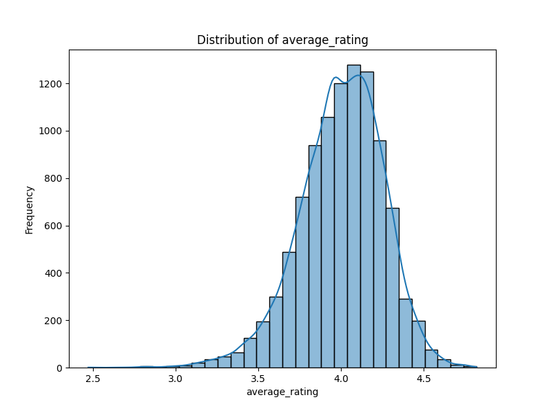

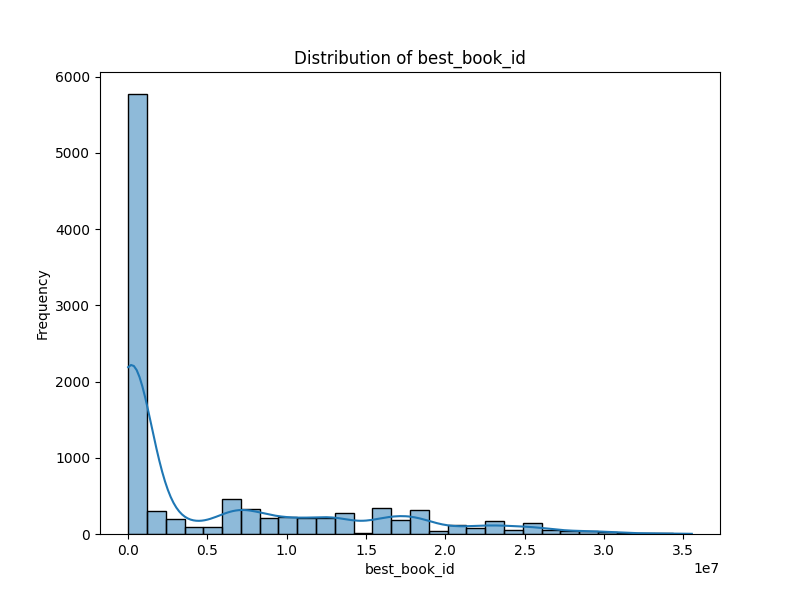

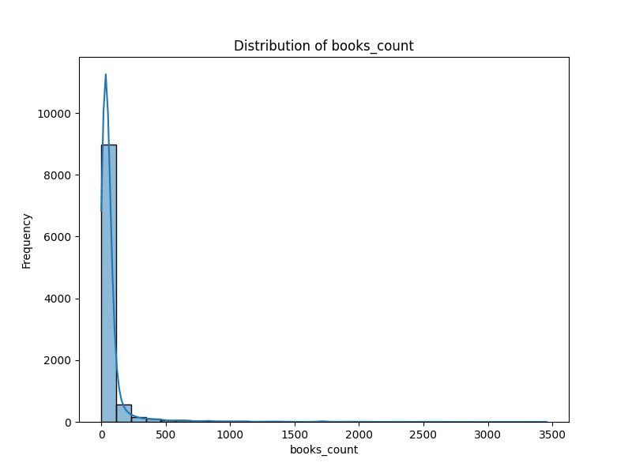

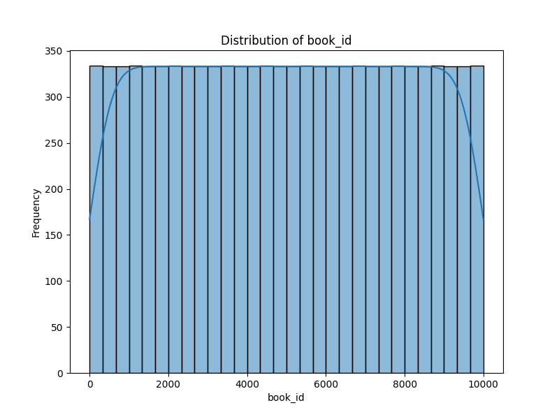

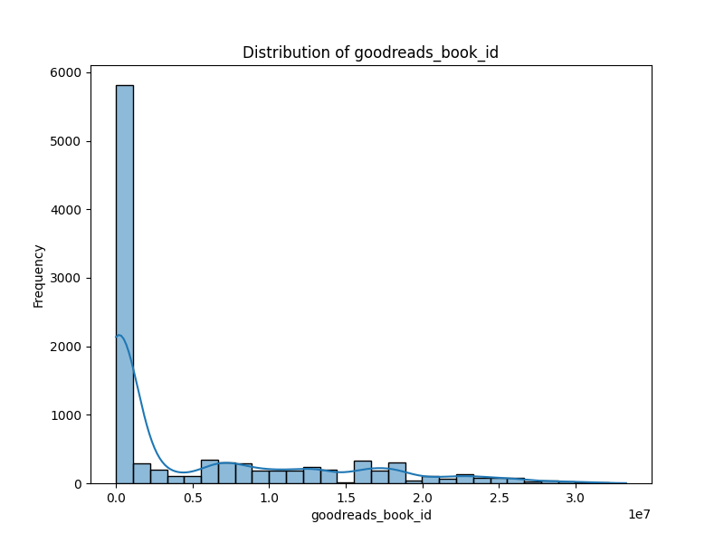

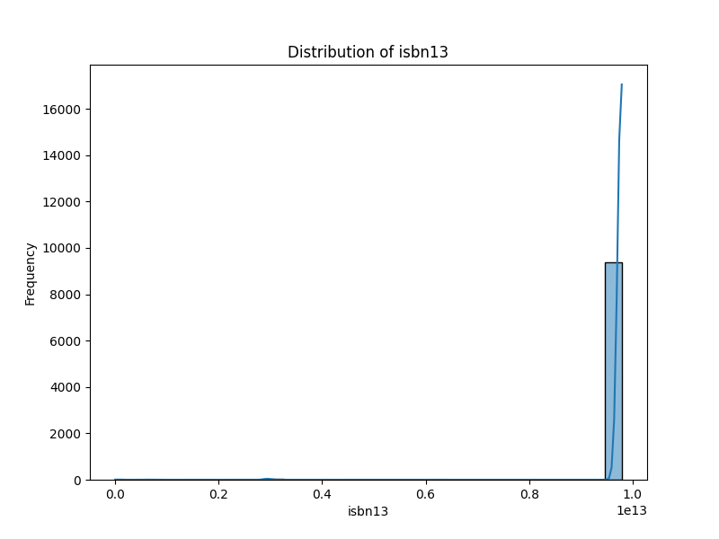

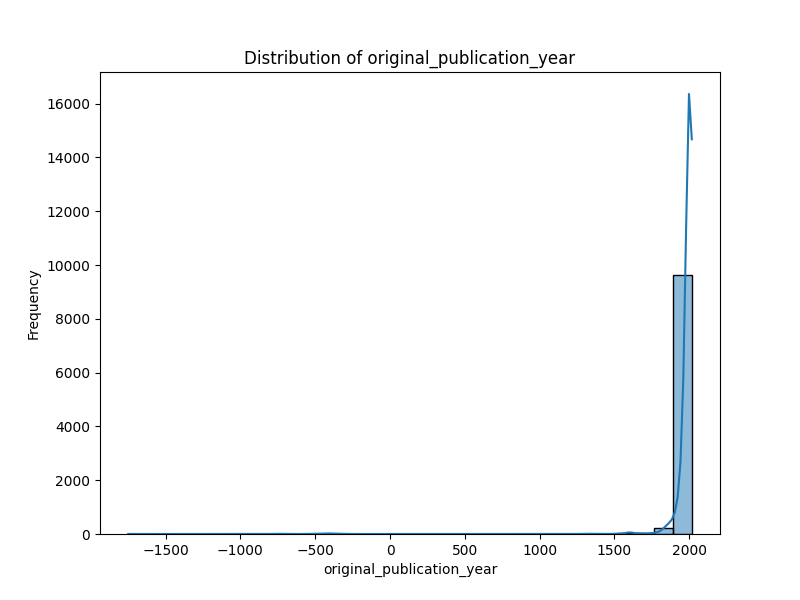

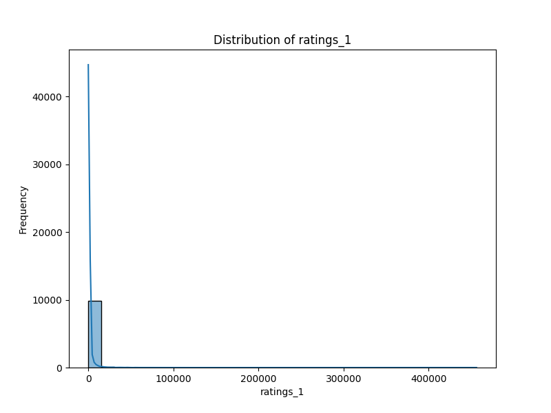

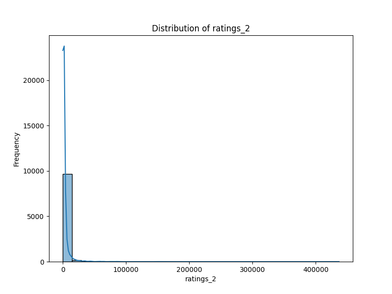

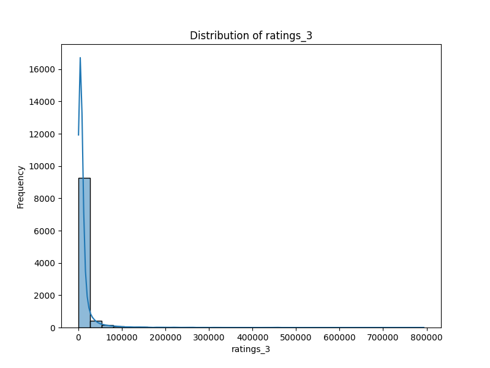

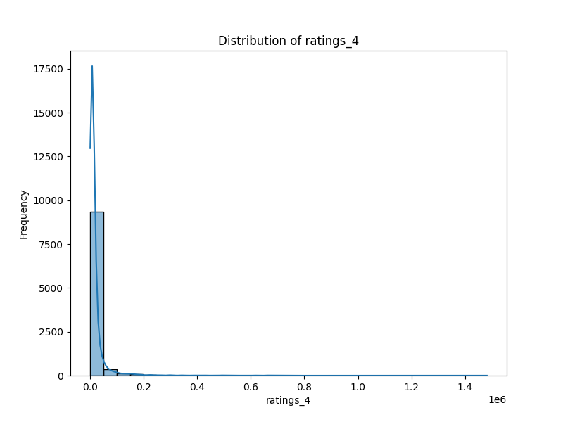

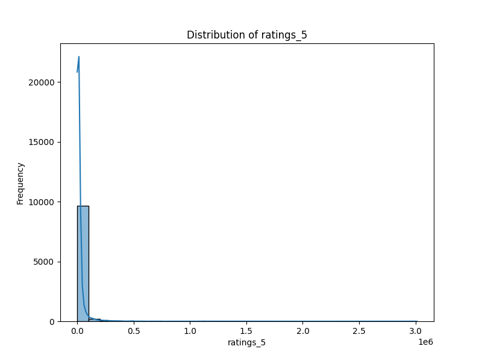

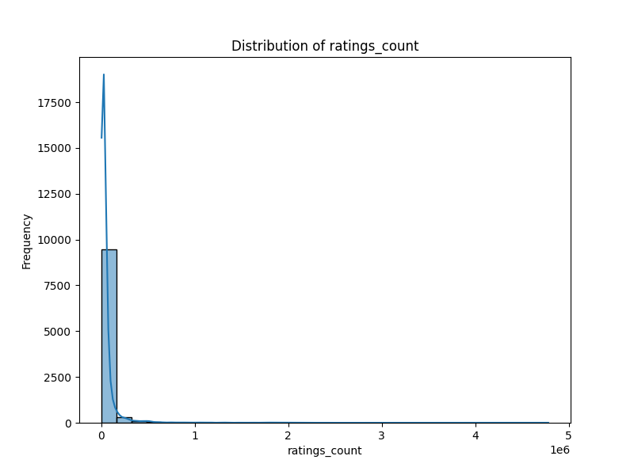

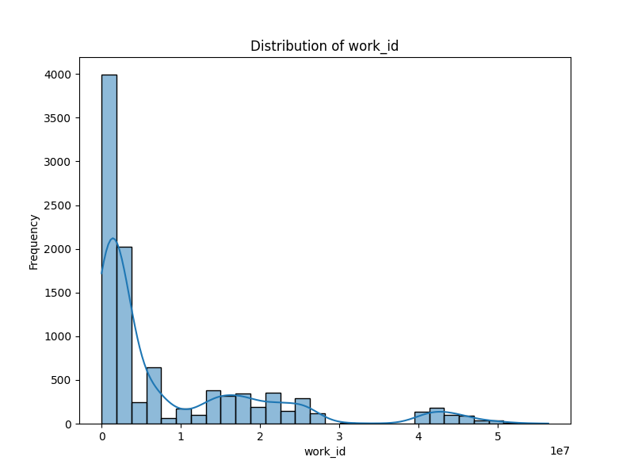

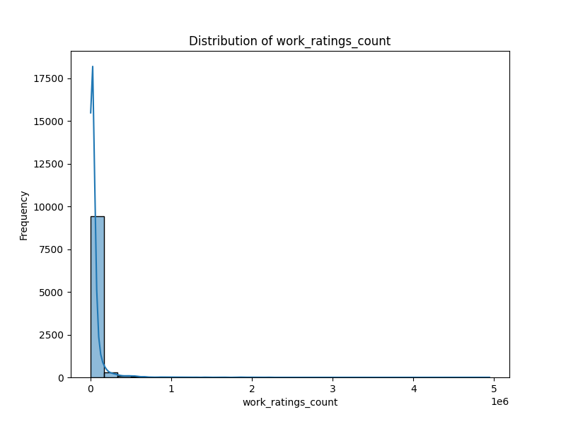

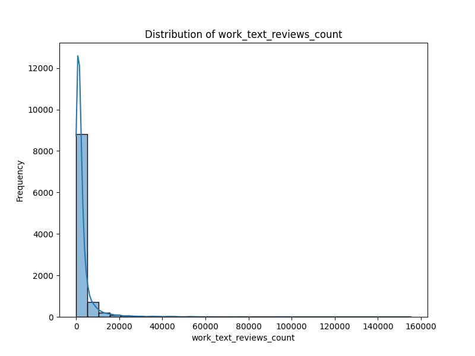
