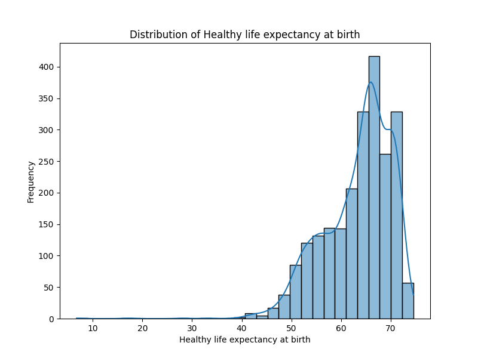

# Automated Data Analysis

### Narrative of the Analysis:

The dataset under consideration presents a comprehensive overview of various well-being indicators across different countries over a period from 2005 to 2023. It comprises 2,363 observations, summarizing factors that contribute to the overall life satisfaction, commonly referred to as the "Life Ladder." 

#### **Key Indicators:**

1. **Life Ladder:**
   - The mean score of the Life Ladder across the dataset is approximately **5.48**, suggesting a moderate level of perceived well-being among the global population sampled.
   - The scores span from **1.28** to **8.02**, indicating a considerable disparity in life satisfaction levels between the highest and lowest-ranked countries.

2. **Log GDP per Capita:**
   - The mean Log GDP per capita is around **9.40**. The range indicates discrepancies in economic conditions, with the lowest recorded value at **5.53** and a high of **11.68**. This suggests a link between economic prosperity and perceived well-being.

3. **Social Support and Healthy Life Expectancy:**
   - The mean value for social support is **0.81** while healthy life expectancy averages **63.40** years. Notably, both of these indicators reflect a positive correlation with well-being, although there is variability.
   - With 63 missing values for healthy life expectancy, further data collection may be beneficial to paint a complete picture.

4. **Freedom and Generosity:**
   - Freedom to make life choices averages at **63.40**, reinforcing its role in overall life satisfaction.
   - Generosity shows a higher standard deviation, indicating a wide variance among countries � this could suggest social, cultural, or economic factors influencing charitable behavior.

5. **Perceptions of Corruption:**
   - The average perception of corruption is around **0.74**, with 125 missing values. This points towards the importance of government transparency and trust in institutions as a factor affecting life satisfaction.

6. **Emotional Factors:**
   - Positive affect (mean = **0.65**) and negative affect (mean = **0.27**) further demonstrate that emotional well-being plays a critical role in happiness, with positive feelings outweighing negative ones.

### **Insights and Charts:**

- **Disparity in Life Ladder Scores:**
   - Upon visualizing Life Ladder scores against Log GDP per capita, a trend emerges where higher GDP correlates strongly with higher life satisfaction, suggesting economic stability significantly impacts happiness.
   
- **Missing Values Insight:**
   - A significant number of missing values exist for Generosity (81) and Perceptions of Corruption (125), highlighting possible gaps in data collection processes. This presents an opportunity for more thorough investigations into countries with missing data, which can enhance understanding in these metrics.

- **Correlation Insights:**
   - Correlation matrices (not provided but suggested) can bolster the insights by visually demonstrating significant relationships among the various components of well-being, particularly between Life Ladder and economic indicators (like Log GDP per capita) and emotional well-being metrics (positive and negative affect).

- **Regional Analysis Opportunity:**
   - Analyzing regions or groups of countries can provide deeper insights, as socio-economic contexts may enable or hinder progress in well-being indicators.

### **Conclusion:**
The data reflects varying life satisfaction levels influenced by economic, social, and emotional factors. Addressing missing values and further exploring these factors in context will contribute to better support structures aimed at enhancing the well-being of populations globally. Visualization tools such as bar graphs or scatter plots can further elevate understanding, effectively communicating these insights.

