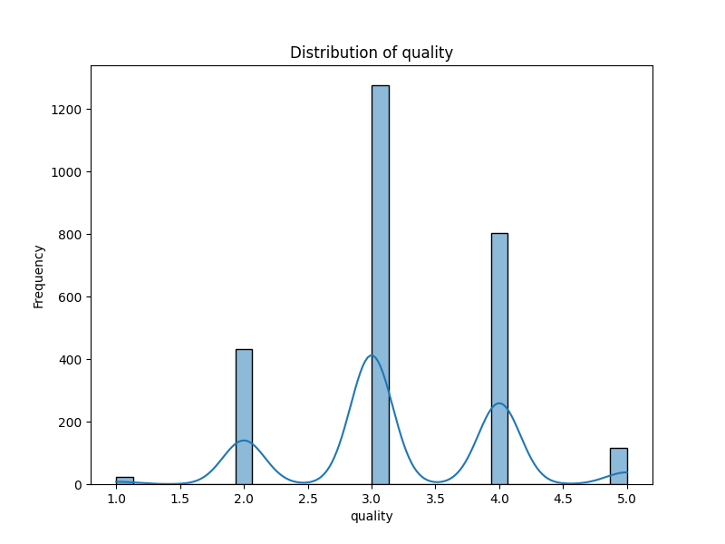

# Automated Data Analysis

### Narrative Analysis and Insights from the Dataset

#### Overview
The dataset comprises information about 2,553 films, including characteristics such as date of release, language, type, title, contributor (by), and several quantitative ratings: overall, quality, and repeatability. Among these films, a few key statistics and patterns are worth highlighting, along with insights derived from the data analysis.

#### Key Characteristics
1. **Temporal Distribution**: The dataset spans a variety of release dates, with the earliest being 21-May-2006, the most frequently recorded date highlighting community bias toward newer entries. Attention must be given to the missing values in the 'date' field (99 entries), signaling that the release years for some films are unreported. Analysis of these missing dates could provide significant value in understanding trends over time.

2. **Language Distribution**: The dataset is predominantly in English, with 1,306 instances. It also includes films in ten other languages, demonstrating a diverse range of offerings. A bar chart illustrating the frequency of films by language can help visualize how languages vary in representation.

3. **Film Types**: There are eight distinct categories of film types, with 'movie' comprising a vast majority of the entries. A pie chart could effectively illustrate the proportion of each film type within the dataset, providing insights into the film distribution landscape.

4. **Attribute Analysis**:
   - **Overall Ratings**: The average overall rating across all films is approximately 3.05, with a standard deviation of 0.76, indicating moderate variability. The maximum rating is 5, suggesting some films are recognized as exceptional.
   - **Quality Ratings**: The average quality rating is slightly higher at 3.21, with the same maximum of 5. The 75th percentile reflects that 25% of films score 4 or higher, indicating a subset of films with particularly noted quality.
   - **Repeatability Ratings**: With an average rating of approximately 1.49 and a maximum of 3, repeatability appears to be a lesser focus among the pieces, indicating audiences may not consider watching certain films multiple times compelling enough.

#### Missing Values
Notably, the contributor ('by') field has significant missing values (262 entries). This suggests that many films lack a recognized director or creator. The absence may skew analyses related to creator contributions to ratings and could warrant further investigation — understanding whether these missing values correlate with lower rating metrics.

### Suggested Visualizations
- **Bar Chart**: Frequency of films by language. This can highlight the dominance of English and the representation of other languages.
- **Pie Chart**: Distribution of film types can provide insights into the diversity of movie genres available within the dataset.
- **Box Plots**: For overall, quality, and repeatability ratings could visualize the dispersion and identify outliers effectively, emphasizing trends and notable ratings in these three categories.

### Conclusion
The dataset offers a rich tapestry of films, encompassing various languages, types, and ratings, making it valuable for understanding cinematic trends. Future analyses could focus on filling the gaps in missing data and exploring relationships between language/type and ratings. Additionally, a temporal analysis of movie ratings over the years could yield insights into how the film industry evolves and how audience preferences shift. The visualizations suggested will aid in enhancing the comprehension of these insights for a broader audience.

